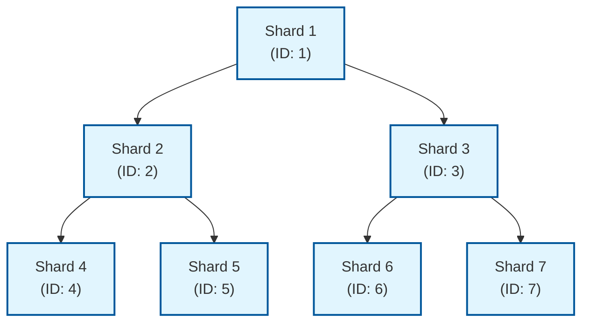

# govm

govm 是一个高性能的分片区块链平台，专注于可扩展性和效率。采用权威证明（PoA）共识机制，支持稳定的交易处理。

## 项目概述

govm 旨在提供一个创新、高效的区块链解决方案，通过独特的分片机制实现高可扩展性。项目采用迭代开发策略，按阶段实现功能。

## 核心特性

### 性能指标
- **区块间隔**: 固定2秒
- **区块大小**: 默认2M
- **验证节点**: 21个
- **分片数量**: 初期只有一个分片
- **性能目标**: 第一阶段以稳定性为主，后续优化性能

### 技术栈
- **开发语言**: Go
- **数据库**: levelDB
- **网络库**: https://github.com/lengzhao/network
- **序列化**: https://github.com/lengzhao/binary
- **共识算法**: POA轮流
- **加密算法**: ECDSA、ED25519

## 系统架构

govm 采用创新的分片架构设计：

1. **应用层**: 客户端应用、钱包应用、API接口
2. **网络层**: P2P网络、节点发现、消息传播
3. **共识层**: DPoS共识、验证者管理、区块生产
4. **核心层**: 区块管理、交易处理、状态管理
5. **分片层**: 分片管理、跨分片通信、区块头哈希同步
6. **存储层**: LevelDB、索引存储

## 核心组件

### 区块结构
- 区块头包含区块序号、时间戳、前一个区块哈希、交易Merkle根等信息
- 创新性地包含当前分片ID和相邻分片的区块头哈希数组（长度为3）
- 区块体包含交易哈希列表

### 分片设计
- 每个分片都是一条独立的区块链
- 每个分片只保存相邻分片的区块头哈希（长度为3的数组）
- 相邻分片的定义：
  - 父分片：`shardID = self.ShardID / 2`
  - 左子分片：`shardID = self.ShardID * 2`
  - 右子分片：`shardID = self.ShardID * 2 + 1`



相邻分片关系示例：
- 分片1的相邻分片：无父分片，左子分片2，右子分片3
- 分片2的相邻分片：父分片1，左子分片4，右子分片5
- 分片3的相邻分片：父分片1，左子分片6，右子分片7
- 分片4的相邻分片：父分片2，无左子分片，无右子分片

### 创世区块设计
- 第一个分片（ShardID=1）通过配置文件保证网络的创世区块生成
- 子分片通过在第一分片的交易创建，经过一段时间的公示期后确认参数
- 公示期过后，参数确定，能够确认指定分片的创世区块所需的所有信息
- 所有的创世区块都不需要签名
- 创世区块的时间戳基于创建分片的时间，确保所有节点生成相同的创世区块

### 交易模型
- 支持基本转账功能
- 包含发送方地址、接收方地址、转账金额等字段
- 通过数字签名确保交易安全
- 包含分片ID字段，用于标识交易所属的分片
- 使用Gas机制（GasPrice和GasLimit）计算交易费用

### 权威证明共识机制（PoA）
- 固定21个验证节点
- 轮流出块机制
- 即时确认（简化版）

## 加密模块

项目包含一个功能完整的加密模块，支持以下功能：

- **Ed25519签名算法**: 快速且安全的数字签名算法
- **ECDSA签名算法**: 椭圆曲线数字签名算法
- **哈希函数**: SHA256和Keccak256
- **地址生成**: 从公钥生成区块链地址

更多详细信息请查看 [crypto模块文档](crypto/README.md)。

## 目录结构

```
govm/
├── main.go
├── docs/
│   └── module_structure.md
├── api/
├── consensus/
├── core/
├── crypto/
│   ├── crypto.go
│   ├── crypto_test.go
│   └── README.md
├── network/
├── storage/
├── txpool/
├── types/
└── generator/
```

## 第一阶段开发重点

根据项目规划，第一阶段专注于单分片区块链基础功能的实现，因此：
1. 暂时不实现分片管理模块
2. 区块和交易结构中包含分片ID字段，但初期固定为单一值
3. 验证节点数量固定为21个
4. 区块间隔固定为2秒，区块大小默认2M

## 开发建议

1. **初期重点**：按照项目规划，专注实现单分片模式下的完整区块链功能
2. **模块独立性**：各模块应保持相对独立，通过清晰的接口进行交互
3. **可扩展性**：在设计时考虑未来多分片的支持，预留扩展点但暂不实现
4. **测试覆盖**：每个模块都需要完善的单元测试和集成测试