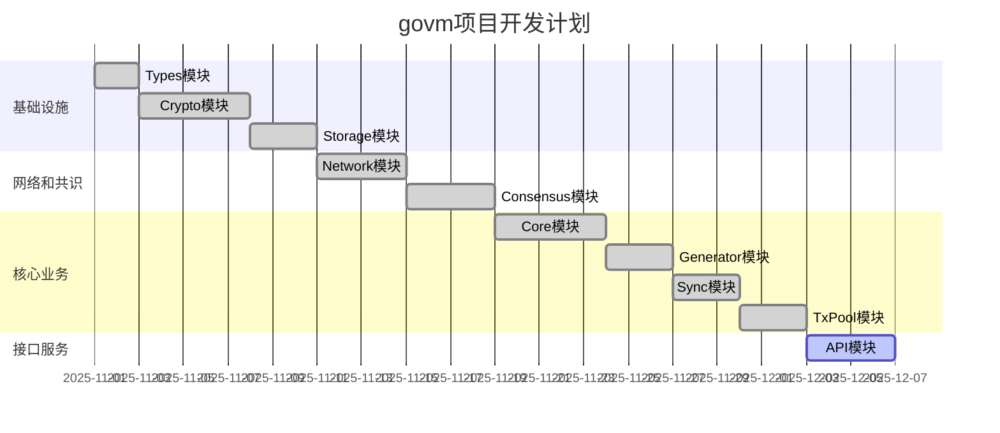

# govm项目模块开发顺序和计划

## 项目概述
govm是一个高性能分片区块链平台，采用权威证明（PoA）共识机制，支持21个验证节点轮流出块，区块间隔2秒。项目采用模块化设计，包含网络、共识、存储、加密等多个核心模块。

## 模块依赖关系分析
根据项目文档和代码分析，各模块之间的依赖关系如下：

1. **types模块** - 所有其他模块的基础依赖
2. **crypto模块** - 被大多数模块依赖，提供加密功能
3. **storage模块** - 被core、consensus等模块依赖，提供数据持久化
4. **network模块** - 被generator、api等模块依赖，提供网络通信
5. **consensus模块** - 依赖crypto，被generator依赖
6. **core模块** - 依赖storage、crypto等，是区块链核心逻辑
7. **generator模块** - 依赖consensus、storage等，负责区块生成
8. **txpool模块** - 被generator依赖，负责交易池管理
9. **api模块** - 对外提供接口服务

详细的模块依赖关系请参考 [module_dependencies.md](./module_dependencies.md) 文件。

## 推荐开发顺序

### 第一阶段：基础设施模块（核心基础）
1. **types模块**
   - 实现区块、交易等核心数据结构
   - 定义公共接口和常量
   - 优先级：最高
   - 预估时间：1-2天
   - **状态：已完成**

2. **crypto模块**
   - 实现各种加密算法（ECDSA、Ed25519等）
   - 完善密钥管理和地址生成功能
   - 优先级：最高
   - 预估时间：3-5天
   - **状态：已完成**

3. **storage模块**
   - 实现基于LevelDB的数据存储
   - 支持命名空间隔离
   - 优先级：高
   - 预估时间：2-3天
   - **状态：已完成**

### 第二阶段：网络和共识模块
4. **network模块**
   - 实现P2P网络通信基础
   - 消息广播和点对点通信
   - 优先级：高
   - 直接使用github.com/lengzhao/network
   - **状态：已完成（使用现有库）**

5. **consensus模块**
   - 实现PoA共识机制
   - 验证节点管理和轮流出块
   - 优先级：高
   - 预估时间：3-4天
   - **状态：已完成**

### 第三阶段：核心业务模块
6. **core模块**
   - 实现区块链核心逻辑
   - 区块和交易处理
   - 状态管理
   - 优先级：最高（第三阶段）
   - 预估时间：4-5天
   - **状态：已完成网络消息处理器自动注册功能**

7. **generator模块**
   - 实现区块生成功能
   - 与交易池交互
   - 优先级：中
   - 预估时间：2-3天
   - **状态：已完成与交易池集成及区块生成逻辑迁移**

8. **sync模块**
   - 实现节点间同步功能
   - 支持区块数据同步
   - 优先级：中
   - 预估时间：2-3天
   - **状态：已完成基础功能**

### 第四阶段：接口和服务模块
9. **txpool模块**
   - 实现交易池功能
   - 交易验证和管理
   - 优先级：高
   - 预估时间：2-3天
   - **状态：已完成基础功能**

10. **api模块**
    - 实现RESTful API接口
    - 提供对外服务
    - 优先级：中
    - 预估时间：3-4天
    - **状态：接口定义完成，实现缺失**

## 开发计划甘特图概念示意

## 关键注意事项

1. **模块独立性**：严格按照依赖关系开发，确保各模块间接口清晰
2. **测试驱动**：每个模块都需要配套的单元测试
3. **文档同步**：随着开发进度及时更新相关文档
4. **分片特性**：虽然第一阶段专注单分片，但设计时要考虑未来多分片扩展
5. **安全考量**：加密模块要特别注意安全性，所有密码学实现都要经过严格测试

## 风险提示

1. **缺失模块**：API模块尚未实现，需要补充
2. **依赖库版本**：确保所有第三方库版本兼容性
3. **性能瓶颈**：LevelDB在高并发场景下可能成为瓶颈，需要做好性能测试

## 当前项目状态总结

### 已完成模块
- Types模块：已完成核心数据结构定义
- Crypto模块：已实现多种加密算法和密钥管理功能
- Storage模块：已实现LevelDB存储和命名空间隔离
- Network模块：已集成github.com/lengzhao/network库
- Consensus模块：已实现PoA共识机制和验证节点管理
- Core模块：已完成网络消息处理器自动注册功能
- Generator模块：已完成与交易池集成及区块生成逻辑迁移
- Sync模块：已实现节点间同步功能
- TxPool模块：已完成基础交易池功能

### 未完成模块
- API模块：仅有接口定义，缺少具体实现

### 需要完善的模块
- Main模块：需要完善配置加载和错误处理
- Consensus模块：需要完善验证者动态更新机制
- Core模块：需要完善状态管理功能
- Sync模块：需要增强网络交互能力
- TxPool模块：需要完善交易选择和验证逻辑