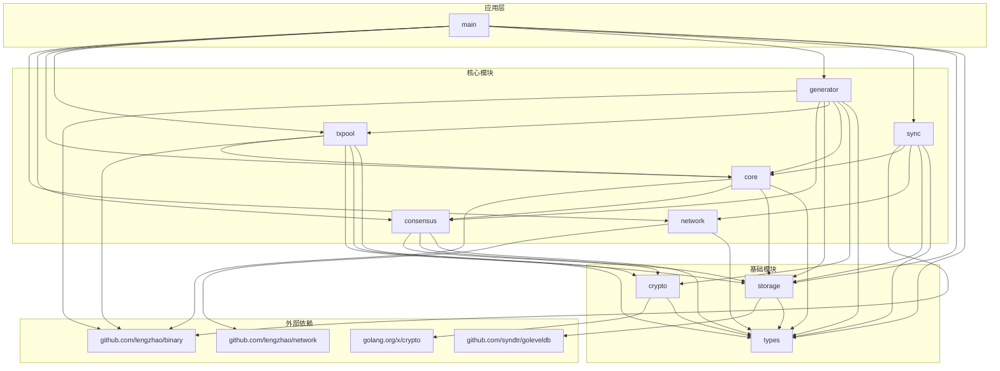

# govm模块依赖关系梳理

## 模块概览

govm项目采用模块化设计，包含以下核心模块：
- **core**: 区块链核心模块，负责区块链基础功能
- **txpool**: 交易池模块，负责交易管理
- **generator**: 区块生成器模块，负责区块生成
- **sync**: 同步模块，负责节点间数据同步
- **consensus**: 共识模块，负责PoA共识算法
- **network**: 网络模块，负责P2P网络通信
- **storage**: 存储模块，负责数据持久化
- **crypto**: 加密模块，负责加密算法和密钥管理
- **types**: 类型定义模块，定义公共数据结构

## 模块依赖关系图

## 详细依赖关系说明

### 1. types模块
**依赖**: 无
**被依赖**: crypto, storage, network, consensus, core, txpool, generator, sync
**说明**: 所有其他模块的基础依赖，定义了公共数据结构和接口

### 2. crypto模块
**依赖**: types, golang.org/x/crypto
**被依赖**: core, txpool, generator, sync
**说明**: 提供加密功能，包括各种签名算法和哈希函数

### 3. storage模块
**依赖**: types, github.com/syndtr/goleveldb
**被依赖**: consensus, core, txpool, generator, sync
**说明**: 提供数据持久化功能，基于LevelDB实现

### 4. network模块
**依赖**: types, github.com/lengzhao/network
**被依赖**: core, sync, main
**说明**: 提供P2P网络通信功能

### 5. consensus模块
**依赖**: types, crypto, storage
**被依赖**: core, generator, main
**说明**: 实现PoA共识机制和验证节点管理

### 6. core模块
**依赖**: types, consensus, storage, network
**被依赖**: txpool, generator, sync, main
**说明**: 区块链核心逻辑，包括区块和交易处理

### 7. txpool模块
**依赖**: types, core, storage, crypto
**被依赖**: generator, main
**说明**: 交易池管理，负责交易验证和存储

### 8. generator模块
**依赖**: types, consensus, storage, core, txpool, crypto
**被依赖**: main
**说明**: 区块生成器，负责从交易池中选择交易并生成新区块

### 9. sync模块
**依赖**: types, core, network, storage
**被依赖**: main
**说明**: 节点间同步功能，支持区块数据同步

### 10. main模块
**依赖**: types, consensus, core, txpool, generator, sync, storage, network
**说明**: 主程序入口，负责初始化所有模块并协调它们的工作

## 模块间交互关系

### core ↔ txpool
- **core为txpool提供**: 交易验证功能([ValidateTransaction](file:///Volumes/ssd/myproject/govm/core/core.go#L29-L29))
- **txpool为core提供**: 无直接提供，但通过generator间接为core提供待处理交易

### core ↔ generator
- **core为generator提供**: 区块链状态查询功能([GetLastBlock](file:///Volumes/ssd/myproject/govm/core/core.go#L21-L21), [GetHeight](file:///Volumes/ssd/myproject/govm/core/core.go#L24-L24)等)
- **generator为core提供**: 生成的新区块通过core的[AddBlock](file:///Volumes/ssd/myproject/govm/core/core.go#L27-L27)方法添加到区块链

### core ↔ sync
- **core为sync提供**: 区块链数据访问([GetBlockByHeight](file:///Volumes/ssd/myproject/govm/core/core.go#L25-L25), [AddBlock](file:///Volumes/ssd/myproject/govm/core/core.go#L27-L27)等)和共识信息([GetConsensus](file:///Volumes/ssd/myproject/govm/core/core.go#L15-L15))
- **sync为core提供**: 网络同步功能，保持节点间数据一致性

### txpool ↔ generator
- **txpool为generator提供**: 交易选择功能([SelectTransactions](file:///Volumes/ssd/myproject/govm/txpool/txpool.go#L17-L17))
- **generator为txpool提供**: 无直接提供，但会从txpool中选择交易用于区块生成

### generator ↔ consensus
- **consensus为generator提供**: 验证者信息([GetCurrentValidator](file:///Volumes/ssd/myproject/govm/consensus/consensus.go#L56-L56))和出块权限检查([IsMyTurn](file:///Volumes/ssd/myproject/govm/consensus/consensus.go#L53-L53))
- **generator为consensus提供**: 无直接提供

### sync ↔ network
- **network为sync提供**: P2P网络通信功能，包括点对点请求([SendRequest](file:///Volumes/ssd/myproject/govm/sync/sync_impl.go#L201-L201))
- **sync为network提供**: 网络消息处理器注册

### core ↔ network
- **network为core提供**: P2P网络通信功能
- **core为network提供**: 网络消息处理器注册([SetNetwork](file:///Volumes/ssd/myproject/govm/core/core.go#L32-L32))

## 循环依赖解决方案

为了解决sync和generator模块之间的循环依赖问题，我们引入了接口隔离：

1. 在[types模块](file:///Volumes/ssd/myproject/govm/types)中定义了`SyncChecker`接口，只包含[IsSyncing() bool](file:///Volumes/ssd/myproject/govm/sync/sync.go#L41-L41)方法
2. [sync模块](file:///Volumes/ssd/myproject/govm/sync)实现了`Syncer`接口，其中包含了`SyncChecker`接口
3. [generator模块](file:///Volumes/ssd/myproject/govm/generator)只依赖`SyncChecker`接口，而不是直接依赖[sync模块](file:///Volumes/ssd/myproject/govm/sync)
4. [main模块](file:///Volumes/ssd/myproject/govm/main.go)中将[sync.Syncer](file:///Volumes/ssd/myproject/govm/sync/sync.go#L30-L42)实例传递给generator，利用Go语言的隐式接口实现

这种设计遵循了依赖倒置原则，避免了模块间的直接循环依赖。

## 网络通信优化

sync模块已优化网络通信方式：
1. 使用点对点请求([SendRequest](file:///Volumes/ssd/myproject/govm/sync/sync_impl.go#L201-L201))替代广播方式请求数据
2. 直接向验证节点发送同步请求，提高通信效率
3. 通过共识模块获取验证节点列表，确保请求发送给正确的节点

## 模块初始化顺序

根据依赖关系，模块初始化顺序应为：
1. types (基础)
2. crypto, storage (基础服务)
3. network, consensus (基础设施)
4. core (核心)
5. txpool, sync (核心服务)
6. generator (业务逻辑)
7. main (应用入口)

在main.go中的实际初始化顺序：
1. storage (存储模块)
2. network (网络模块)
3. consensus (共识模块)
4. core (核心模块)
5. txpool (交易池模块)
6. sync (同步模块)
7. generator (区块生成器模块)

这种顺序确保了每个模块在初始化时其依赖都已经准备就绪。