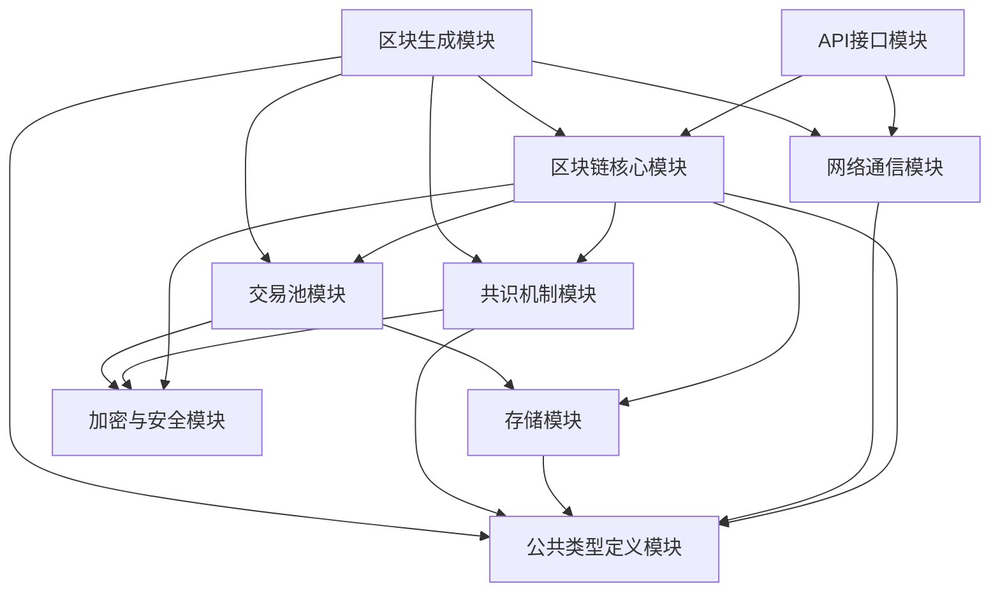

# 区块链项目模块划分文档

## 概述

本文档详细描述了govm区块链项目的模块划分结构，明确了各模块的职责和相互关系，为项目开发提供指导。

## 模块划分

### 1. 公共类型定义模块 (types)
- **功能职责**：定义项目中使用的公共数据结构、接口和常量
- **包含内容**：
  - 区块和交易的基本数据结构
  - 网络消息结构定义
  - 错误码和常量定义
  - 公共接口定义
- **使用方式**：被其他模块导入使用

### 2. 网络通信模块 (network)
- **功能职责**：负责P2P网络通信、节点发现、消息传播
- **技术实现**：基于 https://github.com/lengzhao/network 网络库
- **核心接口**：[NetworkInterface](file:///Volumes/ssd/myproject/govm/network/network.go#L12-L12)
- **子模块**：
  - 消息广播与处理
  - 点对点通信
  - 节点连接管理

### 3. 区块链核心模块 (core)
- **功能职责**：区块管理、交易处理、状态维护
- **子模块**：
  - 区块结构定义与操作
  - 交易模型与验证
  - Merkle树实现
  - 创世区块生成

### 4. 共识机制模块 (consensus)
- **功能职责**：实现PoA权威证明共识算法
- **核心特性**：
  - 固定21个验证节点
  - 轮流出块机制（区块间隔固定为2秒）
  - 即时确认（简化版）
- **子模块**：
  - 验证节点管理
  - 轮流出块调度
  - 区块验证与确认
  - 共识规则检查

### 5. 区块生成模块 (generator)
- **功能职责**：负责从交易池中获取交易并生成新区块
- **核心特性**：
  - 与交易池交互获取待处理交易
  - 构建区块结构
  - 调用共识模块进行区块签名
  - 区块广播到网络
- **子模块**：
  - 交易选择器：从交易池中选择合适的交易
  - 区块构建器：组装区块结构
  - 出块调度器：按照2秒间隔调度出块

### 6. 存储模块 (storage)
- **功能职责**：数据持久化存储
- **技术实现**：LevelDB
- **子模块**：
  - 区块数据存储
  - 交易数据存储
  - 账户状态管理
  - 验证者信息存储

### 7. 交易池模块 (txpool)
- **功能职责**：管理待处理交易
- **子模块**：
  - 交易验证
  - 交易存储
  - 交易选择

### 8. 加密与安全模块 (crypto)
- **功能职责**：保障系统安全
- **技术实现**：ECDSA、ED25519算法
- **子模块**：
  - 数字签名与验证
  - 哈希算法实现
  - Nonce防重放攻击
  - 节点身份验证

### 9. 序列化模块 (serialize)
- **功能职责**：数据序列化与反序列化
- **技术实现**：https://github.com/lengzhao/binary
- **说明**：直接使用现成的序列化库，无需重新定义接口

### 10. API接口模块 (api)
- **功能职责**：对外提供RESTful API服务
- **子模块**：
  - 钱包接口
  - 交易接口
  - 查询接口
  - 节点状态接口

## 模块依赖关系



## 目录结构

```
govm/
├── main.go
├── docs/
│   └── module_structure.md
├── api/
├── consensus/
├── core/
├── crypto/
├── network/
├── storage/
├── txpool/
├── types/
└── generator/
```

## 第一阶段开发重点

根据项目规划，第一阶段专注于单分片区块链基础功能的实现，因此：
1. 暂时不实现分片管理模块
2. 区块和交易结构中包含分片ID字段，但初期固定为单一值
3. 验证节点数量固定为21个
4. 区块间隔固定为2秒，区块大小默认2M

## 开发建议

1. **初期重点**：按照项目规划，专注实现单分片模式下的完整区块链功能
2. **模块独立性**：各模块应保持相对独立，通过清晰的接口进行交互
3. **可扩展性**：在设计时考虑未来多分片的支持，预留扩展点但暂不实现
4. **测试覆盖**：每个模块都需要完善的单元测试和集成测试