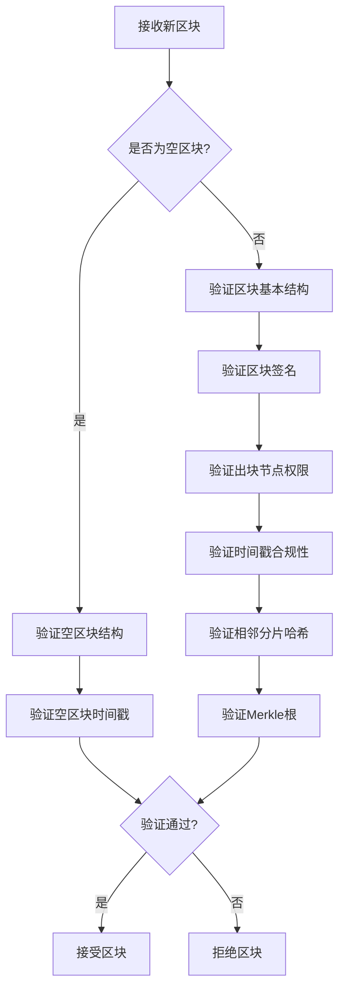
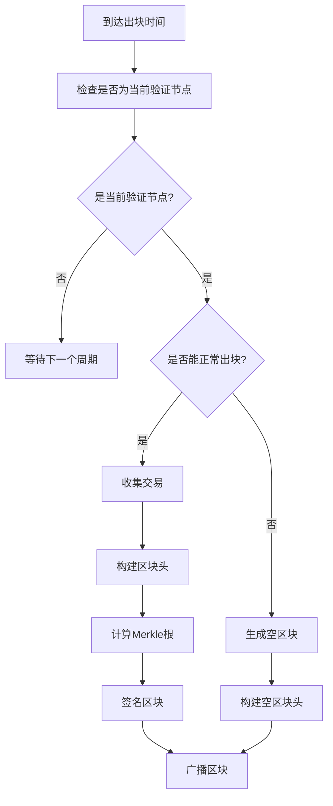
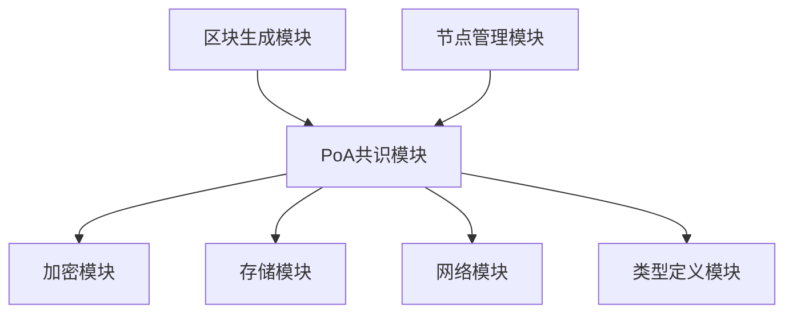

# PoA共识机制详细设计文档

## 1. 概述

本设计文档详细描述了govm区块链平台中权威证明（Proof of Authority, PoA）共识机制的实现方案。PoA是一种基于身份认证的共识算法，通过预先授权的验证节点轮流产生区块来维护区块链的一致性。

## 2. 设计原则

### 2.1 安全性
- 验证节点身份必须经过严格审核和授权
- 区块签名验证确保数据完整性
- 防止恶意节点攻击网络

### 2.2 高效性
- 固定2秒的区块间隔时间
- 轮流出块机制减少共识延迟
- 简化版即时确认提高交易处理速度

### 2.3 可靠性
- 21个固定验证节点提供网络稳定性
- 轮换机制确保公平性
- 故障转移机制保障持续运行
- 空区块机制确保链的连续性

## 3. 核心概念

### 3.1 验证节点（Validator）
- 固定数量：21个
- 预先授权的身份节点
- 负责区块生成和验证
- 拥有网络中的出块权利

### 3.2 轮次（Round）
- 表示一轮完整的验证节点出块周期
- 每轮包含21个区块（每个验证节点一个）
- 当前轮次 = 区块高度 / 21

### 3.3 轮值（Turn）
- 当前轮次中应该出块的验证节点索引
- 计算公式：turn = 区块高度 % 21
- 确保验证节点按顺序轮流出块

### 3.4 空区块（Empty Block）
- 当验证节点异常无法正常出块时使用的替代区块
- 包含完整的区块头信息，包括正确的时间戳、高度和前一个区块哈希
- 不包含任何交易
- 不包含签名
- 确保区块链的连续性和稳定性

## 4. 数据结构设计

### 4.1 PoA共识配置
```go
// PoAConfig PoA共识配置
type PoAConfig struct {
    Validators    []types.Address // 验证节点地址列表
    BlockInterval uint64         // 区块间隔时间（毫秒）
    RoundLength   uint64         // 轮次长度（区块数）
}
```

### 4.2 验证节点信息
```go
// ValidatorInfo 验证节点信息
type ValidatorInfo struct {
    Address     types.Address // 节点地址
    PublicKey   []byte        // 公钥
    Stake       uint64        // 抵押金额（保留字段）
    LastBlock   uint64        // 最后出块高度
    IsActive    bool          // 是否活跃
}
```

### 4.3 共识状态
```go
// ConsensusState 共识状态
type ConsensusState struct {
    CurrentRound  uint64        // 当前轮次
    CurrentTurn   uint64        // 当前轮值
    Validators    []ValidatorInfo // 验证节点信息
    LastBlockTime uint64        // 上一个区块时间戳
}
```

### 4.4 空区块标识
```go
// EmptyBlockMarker 空区块标识（已废弃，现在通过签名是否为空来判断）
// const EmptyBlockMarker = "EMPTY_BLOCK"
```

## 5. 核心算法流程

### 5.1 区块验证流程


### 5.2 区块生成流程


## 6. 核心功能实现

### 6.1 验证节点管理
- **节点管理职责分离**：PoA共识模块不负责节点的注册和注销，这些功能由区块链的其他模块负责
- **节点列表接口**：共识模块提供接口允许外部模块设置和替换验证节点列表
- **节点状态监控**：实时监控节点在线状态和性能

### 6.2 轮流出块调度
- **时间同步**：所有节点基于UTC时间同步
- **出块时机计算**：根据区块高度和时间戳确定出块权
- **超时处理**：当前验证节点未按时出块时的处理机制

### 6.3 区块验证规则
1. **签名验证**：使用[crypto](./crypto/crypto.go#L25-L25)模块验证区块签名（空区块除外）
2. **权限验证**：检查出块节点是否为当前轮值验证节点
3. **时间验证**：区块时间戳必须符合预定间隔
4. **结构验证**：验证区块结构完整性和字段有效性
5. **分片验证**：验证相邻分片区块头哈希的有效性

### 6.4 空区块机制
1. **触发条件**：当验证节点无法正常出块时（如交易池为空、系统异常等）
2. **生成规则**：
   - 区块头字段按标准填充
   - 交易列表为空
   - 不包含签名字段或签名为空
   - 时间戳为当前时间
3. **验证规则**：
   - 验证区块结构完整性
   - 验证出块节点权限
   - 验证时间戳合理性
   - 不验证签名

### 6.5 即时确认机制
- **简化确认**：由于验证节点固定且可信，可实现即时确认
- **双确认机制**：连续两个区块确认后认为交易最终确认
- **回滚处理**：在网络分区等异常情况下处理区块回滚

## 7. 接口设计

### 7.1 Consensus接口
```go
// Consensus 代表共识机制接口
type Consensus interface {
    // ValidateBlock 验证区块是否符合共识规则，包括签名验证和共识规则检查
    ValidateBlock(block *types.Block) error

    // GetValidator 获取当前验证者
    GetValidator() interface{}

    // GetValidators 获取所有验证者列表
    GetValidators() []interface{}
}
```

### 7.2 PoAConsensus接口
```go
// PoAConsensus PoA共识机制的具体实现接口
type PoAConsensus interface {
    Consensus

    // GetRound 获取当前轮次
    GetRound() uint64

    // GetTurn 获取当前轮值索引
    GetTurn() uint64

    // IsValidator 检查节点是否为验证者
    IsValidator(addr types.Address) bool
    
    // UpdateValidators 更新验证节点列表
    UpdateValidators(validators []types.Address) error
}
```

## 8. 模块依赖关系



### 8.1 与加密模块的关系
- 使用[crypto](./crypto/crypto.go#L25-L25)模块进行区块签名和验证
- 依赖公钥基础设施验证验证节点身份
- 空区块不需要签名验证

### 8.2 与存储模块的关系
- 存储验证节点列表和状态信息
- 持久化共识相关配置

### 8.3 与网络模块的关系
- 验证网络传输的区块信息
- 不直接参与区块广播（由区块生成模块负责）

### 8.4 与区块生成模块的关系
- 区块生成模块负责区块的构造和广播
- 共识模块提供验证功能和权限检查
- 区块生成模块调用共识模块进行区块验证

### 8.5 与节点管理模块的关系
- 节点管理模块负责验证节点的注册、注销和状态管理
- 共识模块通过接口接收节点列表更新
- 节点管理模块可以动态替换验证节点列表

## 9. 安全考虑

### 9.1 验证节点安全
- 验证节点私钥必须安全存储
- 定期轮换验证节点减少攻击风险
- 多重签名机制增加安全性

### 9.2 网络安全
- 使用TLS加密网络通信
- 实施DDoS防护机制
- 节点身份验证防止伪造

### 9.3 数据安全
- 区块数据完整性保护
- 防止重放攻击
- 交易签名防止篡改

### 9.4 空区块安全
- 防止恶意生成空区块攻击网络
- 空区块只能由当前轮值验证节点生成
- 空区块的生成需要记录日志用于审计

## 10. 性能优化

### 10.1 出块优化
- 预计算验证节点顺序减少计算开销
- 批量验证提高处理效率
- 异步签名减少阻塞

### 10.2 验证优化
- 并行验证多个区块
- 缓存频繁访问的验证结果
- 增量验证减少重复计算

### 10.3 存储优化
- 索引优化提高查询效率
- 冷热数据分离
- 压缩存储减少磁盘占用

## 11. 错误处理与恢复

### 11.1 常见错误类型
- 验证节点离线
- 网络分区
- 时间不同步
- 签名验证失败

### 11.2 恢复机制
- 自动故障检测和切换
- 区块链快照和恢复
- 节点状态同步机制
- 空区块替代机制

## 12. 测试策略

### 12.1 单元测试
- 验证节点管理功能测试
- 区块验证逻辑测试
- 轮次计算正确性测试
- 空区块生成和验证测试
- 节点列表更新测试

### 12.2 集成测试
- 多节点网络环境测试
- 网络分区恢复测试
- 性能压力测试
- 空区块机制测试
- 节点动态替换测试

### 12.3 安全测试
- 恶意节点攻击模拟
- 签名伪造测试
- 权限绕过测试
- 空区块滥用测试

## 13. 部署与运维

### 13.1 部署要求
- 至少21个验证节点服务器
- 网络带宽满足区块广播需求
- 存储空间满足区块链增长需求

### 13.2 监控指标
- 区块生成时间
- 网络延迟
- 验证节点在线率
- 系统资源使用率
- 空区块生成频率

### 13.3 维护操作
- 验证节点添加/移除
- 系统升级和补丁应用
- 数据备份和恢复
- 空区块审计

## 14. 未来扩展

### 14.1 动态验证节点
- 支持动态增减验证节点数量
- 实现验证节点选举机制

### 14.2 多分片支持
- 扩展PoA机制支持多分片环境
- 实现跨分片共识协调

### 14.3 混合共识
- 结合PoA与其他共识机制
- 根据网络状况动态调整共识策略

## 15. 总结

PoA共识机制为govm区块链提供了高效、可靠的共识解决方案。通过固定验证节点和轮流出块的方式，在保证网络安全性的前提下实现了高性能的区块生成和确认。空区块机制确保了在节点异常情况下的链连续性，增强了系统的鲁棒性。节点管理职责的分离使得系统架构更加清晰，各模块职责明确，便于维护和扩展。该设计充分考虑了系统的可扩展性、安全性和易维护性，为后续的功能扩展奠定了坚实的基础。